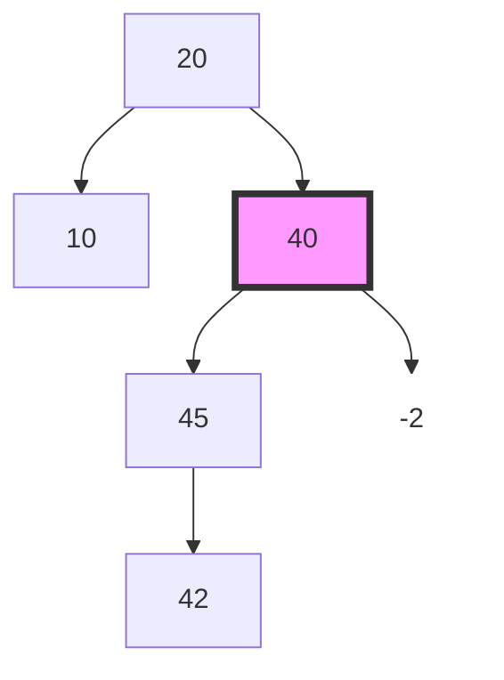

# AVL-G Trees

## Overview
As we have seen in class, AVL trees are excellent for search given their height of $`\log_2{n}`$ or $`\log_2{n} + 1`$. Unfortunately, to achieve this efficient search, they have to use **rotations** during **insertions** and **deletions**, and those take time!

In this project, you will implement **AVL-G** trees, a simple modification of AVL Trees that allows for tuning the balance of an AVL Tree based on a constructor parameter. Simply put, an AVL-G tree, where $`G = 1, 2, 3, \ldots,`$ allows for any given subtree to have a balance of at most G. This means that our classic AVL trees can be referred to as “AVL-1” trees.

## AVL-G Trees
You should be familiar with the following basic definitions of a binary tree:

* **Height** of a binary tree
    * A `null` (empty) binary tree has a height of $`-1`$
    * A non-empty binary tree has a height equal to the maximum of the height of its subtrees $`+ 1`$ (plus one). A corollary of this is that a *stub* binary tree (one that consists of a single *leaf* node without any children) has a height of 0 (zero).
* **Balance** of a node
    * The balance of a node is defined by convention as the height of its **left** subtree minus the height of its **right** subtree.

***TODO: Add diagram and example of imbalance***

The following figure shows an imbalance detected after an insertion into an AVL-1 tree (“classic” AVL tree). The imbalance is detected at the node that contains the key 40 and is equal to -2. If instead we had an AVL-2 tree, this insertion would not have triggered a rotation, since -2 is an admissible balance metric for AVL-2 trees! 

## Starter Code and Git
Everything you need is available in our Github repository. The code for this
project is specifically under the sub-package `projects/avlg`. You will only need to implement the class `AVLGTree`. 

You should read the docs *very carefully*, and make sure you **do not** erase anything from the sub-package `projects/avlg/exceptions`. Those exceptions are used by the AVLGTree class and our tests. You should first run a `git add -A` and a `git commit` to add your code from project 1 to the staging area and then to git’s commit history. Doing a `git pull` should then simply add source code and documentation for project 2. There is a chance that you would need to resolve some **merge conflicts**. To resolve them, simply open the files that the command line is telling you have overlapping changes on and choose the parts of the files you want to keep. Since your first project’s implementation has already been submitted on the submit server, there is **no way** that any code you have written for your projects can be lost, so you don’t have to worry about that at all. 

Note that the submit server does not care at all about your implementation of the first project; it only cares about the class `projects/avlg/AVLGTree`. As with the first project, if you would like to add classes, enums, interfaces, custom exceptions, extra packages, etc., you are **absolutely free** to do so, yet you should **not** move the class `AVLGTree` from its location in the code tree.

## Advice / Hints
* The first thing you should do after you pull the code and read this writeup
is to read the Javadocs for `AVLGTree` to understand its public interface. By
“interface” here we do not refer to a Java interface, but to the way the class “interfaces” with its environment; its API. Once you are certain you
understand what the different methods receive as an argument, what they return to the caller and **what kinds of Exceptions they throw**, start writing unit tests **before** you implement your code.
* The core of this project is **understanding rotations**. When should we
do a single left or a single right rotation? When is a combination of two
rotations appropriate? How can I detect those separate cases in my code?
How do I update **heights** during the rotations in the case of an **insertion** and how in the case of a **deletion**?
* The methods `isBST` and `isAVLGBalanced` that you have to implement are
awesome for testing. Use them to your advantage! Just make sure that they are implemented correctly by unit-testing them as well!
* Read the comments in the file StudentTests.java, which contains some starter tests which you can use for your implementation.
